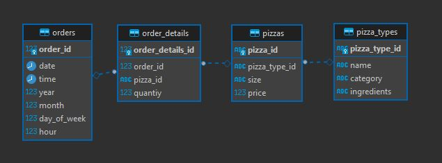

# Trabajo Práctico Final Foundations
### ITBA - Cloud Data Engineering

Bienvenido al TP Final de la sección Foundations del Módulo 1 de la Diplomatura en Cloud Data Engineering del ITBA.

En este trabajo práctico vas a poner en práctica los conocimientos adquiridos en: 

1. Bases de Datos Relacionales (PostgreSQL específicamente).
2. BASH y Linux Commandline.
3. Python 3.7+.
4. Docker.

Para realizar este TP vamos a utlizar la plataforma Github Classrooms donde cada alumno tendrá acceso a un repositorio de Git privado hosteado en la plataforma Github.

En cada repositorio, en la sección de [Issues](https://guides.github.com/features/issues/) (tab a la derecha de Code en las tabs de navegación en la parte superior de la pantalla) podrás ver que hay creado un issue por cada ejercicio. 
El objetivo es resolver ejercicio/issue creando un branch y un pull request asociado. 

Debido a que cada ejercico utiliza el avance realizado en el issue anterior, cada nuevo branch debe partir del branch del ejercicio anterior.

Para poder realizar llevar a cabo esto puede realizarlo desde la web de Github pero recomendamos hacerlo con la aplicación de línea de comando de git o con la aplicación de [Github Desktop](https://desktop.github.com/) (interfaz visual) o [Github CLI](https://cli.github.com/) (interfaz de línea de comando).

La idea de utilizar Github es replicar el ambiente de un proyecto real donde las tareas se deberían definir como issues y cada nuevo feature se debería crear con un Pull Request correspondiente que lo resuelve. 
https://guides.github.com/introduction/flow/
https://docs.github.com/en/github/getting-started-with-github/quickstart/github-flow

**MUY IMPORTANTE: parte importante del Trabajo Práctico es aprender a buscar en Google para poder resolver de manera exitosa el trabajo práctico**

## Ejercicios

### Ejercicio 1: Elección de dataset y preguntas

Elegir un dataset de la [wiki de PostgreSQL ](https://wiki.postgresql.org/wiki/Sample_Databases) u otra fuente que sea de interés para el alumno.

Crear un Pull Request con un archivo en [formato markdown](https://guides.github.com/features/mastering-markdown/) expliando el dataset elegido y  una breve descripción de al menos 4 preguntas de negocio que se podrían responder teniendo esos datos en una base de datos relacional de manera que sean consultables con lenguaje SQL.

Otras fuentes de datos abiertos sugeridas:
https://catalog.data.gov/dataset
https://datasetsearch.research.google.com/
https://www.kaggle.com/datasets

## Ejercicio 2: Crear container de la DB

Crear un archivo de [docker-compose](https://docs.docker.com/compose/gettingstarted/) que cree un container de [Docker](https://docs.docker.com/get-started/) con una base de datos PostgreSQL con la versión 12.7.
Recomendamos usar la [imagen oficial de PostgreSQL](https://hub.docker.com/_/postgres) disponible en Docker Hub.
 
Se debe exponer el puerto estándar de esa base de datos para que pueda recibir conexiones desde la máquina donde se levante el container.

## Ejercicio 3: Script para creación de tablas

Crear un script de bash que ejecute uno o varios scripts SQL que creen las tablas de la base de datos en la base PostgreSQL creada en el container del ejercicio anterior.

Se deben solamente crear las tablas, primary keys, foreign keys y otras operaciones de [DDL](https://en.wikipedia.org/wiki/Data_definition_language) sin crear o insertar los datos. 

## Ejercicio 4: Popular la base de datos

Crear un script de Python que una vez que el container se encuentre funcionando y se hayan ejecutado todas las operaciones de DDL necesarias, popule la base de datos con el dataset elegido.

La base de datos debe quedar lista para recibir consultas. Durante la carga de información puede momentareamente remover cualquier constraint que no le permita insertar la información pero luego debe volverla a crear.

Este script debe ejecutarse dentro de un nuevo container de Docker mediante el comando `docker run`.

El container de Docker generado para no debe contener los datos crudos que se utilizarían para cargar la base.
Para pasar los archivos con los datos, se puede montar un volumen (argumento `-v` de `docker run`) o bien bajarlos directamente desde Internet usando alguna librería de Python (como `requests`).

## Ejercicio 5: Consultas a la base de datos

Escribir un script de Python que realice al menos 5 consultas SQL que puedan agregar valor al negocio y muestre por pantalla un reporte con los resultados.

Este script de reporting debe correrse mediante una imagen de Docker con `docker run` del mismo modo que el script del ejercicio 4.

## Ejercicio 6: Documentación y ejecución end2end

Agregue una sección al README.md comentando como resolvió los ejercicios, linkeando al archivo con la descripción del dataset y explicando como ejecutar un script de BASH para ejecutar todo el proceso end2end desde la creación del container, operaciones de DDL, carga de datos y consultas. Para esto crear el archivo de BASH correspondiente. 

# Dataset Pizzeria Alonso

## Introduccion al dataset

Se analizara el funcionamiento de una pizza de la cual tenemos datos de alrededor de 45 mil ordenes en las cuales de detallan las siguientes columnas repartidas en 4 tablas:

- order_details: que contiene las columnas order_details_id,order_id,pizza_id,quantity
- orders: order_id,date,time
- pizza_type: pizza_type_id,name,category,ingredients
- pizzas: pizza_id,pizza_type_id,size,price

## Diagrama de ER

## Preguntas de negocio

1- ¿Cual es la facturacion mensual y anual?

2- ¿Qué pizza es la que genera mayor ingreso y ventas?

3- ¿Qué categoria es la que genera mayor ingreso y ventas?

4- ¿Cual dia de la semana y hora se venden mayor cantidad de pizzas?

5- ¿Que tipo de pizza y que tamaño es la que mayor ventas tiene? 

 ---

# Ejecucion del proceso ETL + Reporting

En el siguiente apartado encontrará las instrucciones para correr el proceso tanto de forma individual por proceso como de forma general con un script bash generico.

**Importante: la ruta donde se ejecutan los comandos debe ser la principal de donde se encuentran los archivos**

1. Levantar la base de datos de Postgres

Para levantar la base de datos de postgres, solamente hay que ejecutar la siguiente linea de codigo.

`docker-compose up`

Este codigo levanta el docker compose que genera la base datos postgres a partir de la creacion de un container, los detalles son los siguientes:

- postgres:12.12-alpine
- copia el archivo data_tables.sh a la carpeta /usr/local/bin

Este ultimo paso se opto por copiar el archivo y posteriormente dentro del contenedor ejecutar la creacion de las tablas, este script permite el borrado en cascada de la base de datos por si es necesario recargarla por algun motivo.

Detalles de la base de datos creada:

- POSTGRES_SCHEMA='schema_pizza'
- POSTGRES_HOST="postgres-db"
- POSTGRES_DB='database_pizza'

2. Script para la creacion de tablas de la base de datos

Como vimos en el paso anterior el archivo data_tables.sh fue enviado a la carpeta /usr/local/bin dentro del contenedor, para ejecutar el mismo alcanza con ejecutar la siguiente linea:

`docker exec -it postgres-db bash /usr/local/bin/data_tables.sh`

Este paso solamente elimina los datos y tablas de la base de datos para posteriormente crearlas nuevamente.

3. Popular la base datos

Para este paso se genero un script de Python dentro de la carpeta /ETL, el cual se ejecuta mediante un contenedor con las siguientes librerias

- pandas
- openpyxl
- sqlalchemy
- psycopg2-binary

El mismo lee los csv que estan montados localmente en la ruta /ETL/csv_files y a traves de un volumen con el contenedor lee los mismos para posteriormente subirlos a la base de datos.

Para ejecutar este contenedor:

`docker run -it --rm --network nt-pizza -v $PWD/ETL/csv_files:/csv_files test-tp`

4. Consultas a base de datos

Dentro de un archivo python(queries.py) se crearon las queries correspondientes que se utilizaran para generar los dataframes con los caules se generaran los reportes tanto por pantalla como en graficos.

Librerias utilizadas:
- pandas
- openpyxl
- sqlalchemy
- psycopg2-binary
- seaborn
- matplotlib

Para los graficos se utilizo la libreria seaborn y a traves de un volumen generado al correr el contenedor se va a permitir acceder a los mismos localmente.

El comando para ejecutar este paso es el siguiente:

`docker run -it --rm --network nt-pizza -v $PWD/Reports/graphs:/graphs reports-test`

Los graficos generados estan almacenados en la ruta /Reports/Graphs

***

# END TO END

Para ejectuar el proceso end2end se genero un sript de bash(end2end.sh) en el cual se ejecuta todo el proceso desde un solo paso

`bash end2end.sh `

En este paso se ejecutan los pasos del pipeline siguiendo el orden establecido anteriormente.

Nota: Tambien el proceso espera a que se generen las distintas images de los contenedores en caso de que no esten generadas.

# Potenciales mejoras

1- Agregar archivos de configuracion para las contraseñas

2- Presentar en un servidor web los graficos

3- Integrar todo en docker-compose

4- Generar clases y funciones para reducir codigo

